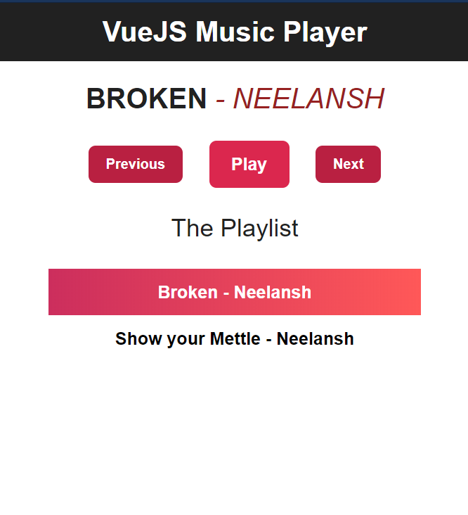

# VueJS Music Application
A simple VueJS Application to play songs that are currently hard-coded into an array in _App.vue_

Avaiable at: https://vuejs-test-nlm-9fe5a.web.app/




## Project setup
```
npm install
```

### Compiles and hot-reloads for development
```
npm run serve
```

### Compiles and minifies for production
```
npm run build
```

### Lints and fixes files
```
npm run lint
```

### Customize configuration
See [Configuration Reference](https://cli.vuejs.org/config/).
